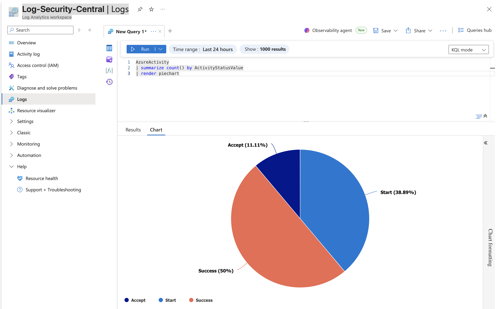

# 🛡️ Azure Enterprise Security Architecture Framework
**Author:** Victoria Castillo (Vicky Castillo) - Security Auditor & Cloud Security Engineer

Welcome to my **Cloud Security Engineering Portfolio**. This repository showcases a comprehensive, end-to-end framework for deploying and governing **highly secure enterprise environments** on Microsoft Azure.

### 🚀 Technical Evolution: From Scripting to Infrastructure as Code (IaC)
This project documents a professional roadmap from manual automation to architectural governance:
- **Foundational Phase (Bash Scripting):** Initial implementation of **Identity & Access Management (IAM)**, **Network Security Groups (NSG)**, and **SOC Operations**. These legacy assets are organized within the `/scripts-bash` directory.
- **Architectural Phase (Terraform):** The current enterprise standard. I have migrated the core infrastructure to **Terraform (HCL)** to enforce **Zero Trust principles**, **Idempotency**, and **Full Auditability**.

### ⚖️ Compliance & Regulatory Mapping
The framework is engineered to meet the stringent requirements of international cybersecurity standards for critical infrastructure:
- **ISO 27001:2022:** Information Security Management and Operational Logging.
- **NIS2 Directive:** Resilience of high-criticality digital systems.
- **GDPR:** Privacy by Design and **EU Data Sovereignty** (Denmark/Western Europe regions).
- **NIST Cybersecurity Framework:** Detection, Protection, and Response capabilities.

---

## 🛡️ Module 1: Automated Identity & Access Management (IAM)
This project demonstrates the automation of identity lifecycle management in Azure Entra ID (formerly Azure AD) using Azure CLI.

### 📋 Compliance & Governance Mapping
- **ISO 27001:2022 Control A.5.15 & A.5.18:** Automated provisioning of identities and enforcement of Role-Based Access Control (RBAC).
- **ISO 27001:2022 Control A.8.28:** Secure coding practices by eliminating hardcoded secrets and using environment variables.
- **GDPR Article 5:** Implementation of the **Principle of Least Privilege (PoLP)** to ensure data confidentiality and integrity.
- **NIS2 Directive:** Strengthening supply chain security through automated asset governance.

### 🚀 Technical Implementation
- **Bulk Provisioning:** Automated creation of 10 security groups and 15 users.
- **Data Integrity:** Used ObjectIDs for membership assignment to prevent syntax errors and ensure precise mapping.
- **Security Best Practices:** Obfuscation of sensitive tenant information and credential management.

  #### 🛠️ Automation & Identity Tools
The specific automation script for RBAC, Managed Identities, and User Provisioning is available here: [Identity_Management_Lab.sh](./scripts-bash/Identity_Management_Lab.sh)

  -------------------------------------------------------------------------------------------------------------------------------

  ## 🛡️ Module 2: Network Security & Infrastructure Hardening
Implementation of a **Zero Trust** network perimeter and micro-segmentation.

### 📋 Compliance Mapping
- **ISO 27001:2022 Control A.8.20 & A.8.22:** Establishing network boundaries and segregating the Front-End subnet from the rest of the environment.
- **ISO 27001:2022 Control A.8.24:** Cryptographic enforcement by restricting insecure protocols (HTTP/80) and permitting only encrypted channels (HTTPS/443).
- **Security by Design:** Ensuring all network assets are provisioned within a predefined security perimeter (NSG-to-Subnet binding).

### 🔍 Technical Audit Logs (CLI Verification)

**1. Network Security Rules Matrix (Compliance A.8.20)**  
Verified prioritized rules for Administrative (SSH/22) and Business (HTTPS/443) traffic.
```text
Name               ResourceGroup    Priority    Access    Protocol    Direction    DestinationPortRanges
-----------------  ---------------  ----------  --------  ----------  -----------  -----------------------
Allow-SSH-Vicky    RG-SecurityLab   100         Allow     Tcp         Inbound      22
Allow-HTTPS-Vicky  RG-SecurityLab   110         Allow     Tcp         Inbound      443
```

**2. Virtual Network Inventory (Asset Management A.5.9)**  
Verification of address space allocation for the security lab environment.
```text
Nombre            Rango
----------------  -----------
VNet-SecurityLab  10.0.0.0/16
```

**3. Security Binding Verification (Network Segregation A.8.22)**  
Final confirmation of the association between the Subnet and the Network Security Group (NSG).
```text
Subred           NSG_Asociado
---------------  ------------------------------------------------------------------------------------------
Subnet-FrontEnd  .../providers/Microsoft.Network/networkSecurityGroups/NSG-Vicky
```

#### 🛠️ Automation & Network Tools
The specific automation script for VNet architecture, Subnetting, and NSG rules is available here: [Network_Security_Hardening.sh](./scripts-bash/Network_Security_Hardening.sh)

__________________________________________________________________________________________________________________________________________

### 🛡️ Module 3: Compute Hardening & Centralized Logging

Implementation of secure compute assets under a **Zero Trust** model and centralized telemetry for audit readiness.

#### 📋 Compliance Mapping

* **ISO 27001:2022 Control A.8.2 & A.8.15:** Enforcement of privileged access via **Managed Identities** (secret-less auth) and establishment of logging repositories for event monitoring.
* **ISO 27001:2022 Control A.8.22:** Compute isolation by disabling **Public IP addresses**, ensuring resources are only accessible via private backbones.
* **GDPR Article 25:** **Data Protection by Design** (EEE Sovereignty) by enforcing data residency within the European Economic Area.
* **NIS2 Directive:** Strengthening asset resilience and monitoring capabilities through **centralized telemetry**.

#### 🔍 Technical Audit Logs (CLI Verification)

##### 1. Secure Compute Inventory (Compliance A.8.22)
Verification of private-only provisioning and **System-Assigned Managed Identity** activation.

```text
Name                Identity_Type    PrivateIP    PublicIP    Status
------------------  ---------------  -----------  ----------  ---------
VM-Security-Prod    SystemAssigned   10.3.1.4     None        Succeeded
```

##### 2. Centralized Telemetry Repository (Audit Trail A.8.15)
Final confirmation of the **Log Analytics Workspace** for SIEM/SOC integration.

```text
Workspace_Name         Region       Provisioning_State    Customer_ID
---------------------  -----------  -------------------  ------------------------------------
Log-Security-Central   westeurope   Succeeded            382e31f7-1981-40f5-b071-1a1b3fc56b7c
```

##### 3. Identity Security Principal (Zero Trust A.8.2)
The VM has been granted a **unique security identity** to eliminate the need for hardcoded credentials:

**PrincipalID:** `088b02b1-dce4-43a0-842d-60ff0d90c893`

---
### 📸 Evidence Gallery - Lab 3


#### 🛠️ Automation & Hardening Tools
The specific automation script for secure compute provisioning and SIEM telemetry baseline is available here: [Compute_Logging_Hardening.sh](./scripts-bash/Compute_Logging_Hardening.sh)

______________________________________________________________________________________________________________________________________________________________

### 🛡️ Module 4: Platform Auditing & Incident Management

#### 📋 Change Control Record (Change Request CR-2026-004)
- **Event:** Regional quota restriction for compute assets (SKU Not Available).
- **Technical Action:** Strategic pivot to **Platform Governance**. Instead of monitoring an individual asset, subscription-level auditing was activated.
- **Security Outcome:** Centralization of the **Azure Activity Log** into the Log Analytics Workspace (The Vault).

#### 🔍 Platform Audit Evidence (ISO 27001 A.8.15)
Bulk export of administrative and security events has been configured towards the regional SIEM in Amsterdam. This enables auditing of:
- Resource creation/deletion attempts.
- Network security policy changes.
- Provider provisioning failures.

> **⚠️ Audit Note (Data Redaction):** The 'Caller' column (User Identity) has been intentionally filtered out from the evidence below to comply with **GDPR Data Minimization** and privacy best practices for public repositories.

**KQL Query for Operations Auditing:**
```kusto
AzureActivity

| where TimeGenerated > ago(24h)
| project TimeGenerated, OperationNameValue, ActivityStatusValue
| order by TimeGenerated desc
```

---
### 📸 Evidence Gallery - Lab 4


### 🛡️ Module 4 (Part 2): SOC Validation & Incident Response

To validate the operational resilience of the architecture, I conducted a Live Security Validation to ensure the SIEM (Log Analytics) and the Alerting System were functioning according to professional standards.

#### 📋 Compliance Mapping

* **ISO 27001:2022 Control A.8.15 & A.8.16:** Establishment of **Logging and Monitoring** activities to detect unauthorized resource modifications and ensure forensic traceability through the centralized SIEM.
* **NIST SP 800-61 / NIST CSF (Detection):** Alignment with the **Incident Handling Guide** by executing the Detection and Analysis phase through simulated adversarial activity.
* **GDPR Article 5 & 25:** Enforcement of **Data Minimization** and **Accountability** by protecting audit trails and redacting PII (Personally Identifiable Information) in public forensic reports.
* **NIS2 Directive:** Strengthening **Incident Management** and operational resilience through proactive monitoring and alerting systems for critical infrastructure.
  
#### 🧪 Incident Simulation & Forensic Analysis
I simulated an unauthorized resource modification to test detection capabilities:
1. **Action:** Manual deletion of a Public IP resource via CLI.
2. **Detection:** The **Azure Activity Log** successfully captured the `DELETE` event.
3. **Traceability:** Using **KQL (Kusto Query Language)**, I extracted the evidence from the Vault, proving the exact timestamp and operation success.
4. **Alerting:** Confirmed that the **Activity Log Alert** was triggered for this critical administrative change.

> **🔒 Security & Privacy Note (Data Redaction):** In the forensic evidence below, the 'Caller' column (User Identity) has been intentionally excluded. This follows **GDPR Data Minimization** principles and best practices for public repositories, ensuring that sensitive PII (Personally Identifiable Information) is not exposed while maintaining the technical integrity of the audit trail.

#### 📸 Technical Evidence - Lab 4 (part 2)


> **Final Conclusion:** This laboratory demonstrates a complete **Secure-by-Design** architecture. From isolated networking and identity-based access to a fully functional SOC with real-time alerting and forensic logging.

#### 📊 SOC Operational Dashboard
To provide executive-level visibility, I developed a real-time dashboard using **KQL (Kusto Query Language)**. This visualization summarizes all platform operations (Success vs. Failure), enabling the SOC team to monitor the overall health of the Azure infrastructure at a glance.

**KQL Visualization Query:**
```kusto
AzureActivity 

| summarize count() by ActivityStatusValue 
| render piechart
```
 

---

### 🛡️ Module 4 (Part 3): Advanced SOC Operations & Infrastructure Hardening

This final module focuses on centralizing telemetry, validating incident response, and hardening the network perimeter, aligned with international security frameworks.

#### 📊 SOC Operational Dashboard & KQL Analysis (ISO 27001 A.12.4.1)
To provide executive-level visibility and satisfy **Continuous Monitoring** requirements, I developed a real-time dashboard using **KQL (Kusto Query Language)**. This visualization summarizes all platform operations, enabling the SOC team to monitor infrastructure health at a glance.

**KQL Visualization Query:**
```kusto
AzureActivity 


| summarize count() by ActivityStatusValue 
| render piechart
```


#### 🧪 Incident Simulation & Traceability (NIST SP 800-61)
I conducted a **Live Security Validation** to test the SIEM's alerting capabilities and incident handling flow:
1. **Simulation:** Manual deletion of a Public IP resource via CLI.
2. **Detection:** The **Azure Activity Log** successfully captured the `DELETE` event.
3. **Traceability:** Verified accountability through forensic KQL queries, ensuring a complete audit trail and **Non-repudiation** (ISO 27001 A.12.4.3).

> **🔒 Security & Privacy Note (Data Redaction):** In the forensic evidence below, the 'Caller' column has been excluded to comply with **GDPR Data Minimization** and privacy best practices for public repositories.

#### 🏰 Advanced Network Hardening (Zero Trust - ISO 27001 A.13.1.1)
To eliminate the attack surface and implement **Network Segregation**, I implemented an **Azure Bastion Host**:
- **Secure Access:** Management is now performed via SSL (Port 443), removing the need for Public IPs on internal assets and mitigating brute-force risks.
- **Inventory Audit:** Conducted a full **Shadow IT cleanup**, decommissioning redundant VNets in non-EU regions to ensure compliance with **Sovereignty** and **FinOps** best practices.

### 📸 Evidence: Bastion Deployment & Final Network Architecture Audit**


#### 🛠️ Automation Tools
The complete automation script for these governance and hardening tasks is available here: [SOC_and_Network_Hardening.sh](./SOC_and_Network_Hardening.sh)

---
### 🛡️ Module 4 (Part 4): Workload Security & SIEM Integration (ISO 27001 / NIS2 / GDPR)
To close the security loop, I deployed a private Linux node and automated its telemetry ingestion, ensuring full visibility of the hospital's internal assets:

1. **Privacy by Design (GDPR Art. 25):** The VM was deployed in the `Subnet-FrontEnd` with **Zero Public Exposure** (no Public IP). This ensures the instance is invisible to the public internet, mitigating 100% of external brute-force attempts.
2. **Automated Auditing (NIS2 & ISO 27001 A.12.4.1):** Injected the **Log Analytics Agent** via Azure VM Extensions. This automation ensures that every new compute resource is under surveillance from its first second of life.
3. **Connectivity Validation (Heartbeat):** Verified the real-time **Heartbeat** signal in the SIEM. This proves the end-to-end telemetry pipeline is operational, from the private network to the centralized log vault in Amsterdam.

### 📸 Evidence: Real-time VM Heartbeat in Log Analytics**


#### 🛠️ Automation & Monitoring Tools
The specific automation script for secure workload provisioning and SIEM integration is available here: [Workload_Security_and_Monitoring.sh](./scripts-bash/Workload_Security_and_Monitoring.sh)

